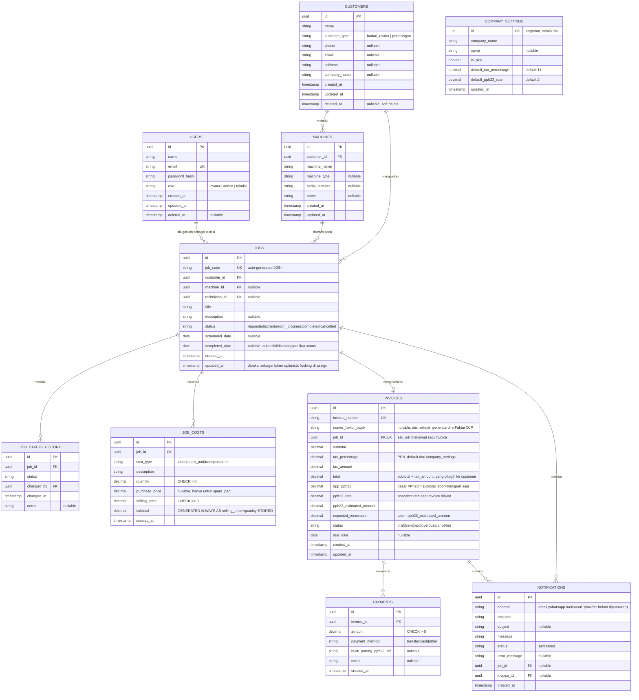

# ERD — CNC Service Project Management App (v3)

```mermaid
erDiagram
    USERS ||--o{ JOBS : "ditugaskan sebagai teknisi"
    CUSTOMERS ||--o{ MACHINES : memiliki
    CUSTOMERS ||--o{ JOBS : mengajukan
    MACHINES ||--o{ JOBS : "diservis pada"
    JOBS ||--o{ JOB_STATUS_HISTORY : memiliki
    JOBS ||--o{ JOB_COSTS : memiliki
    JOBS ||--o| INVOICES : menghasilkan
    INVOICES ||--o{ PAYMENTS : menerima
    JOBS ||--o{ NOTIFICATIONS : memicu
    INVOICES ||--o{ NOTIFICATIONS : memicu

    USERS {
        uuid id PK
        string name
        string email UK
        string password_hash
        string role "owner | admin | teknisi"
        timestamp created_at
        timestamp updated_at
        timestamp deleted_at "nullable"
    }

    CUSTOMERS {
        uuid id PK
        string name
        string customer_type "badan_usaha | perorangan"
        string phone "nullable"
        string email "nullable"
        string address "nullable"
        string company_name "nullable"
        timestamp created_at
        timestamp updated_at
        timestamp deleted_at "nullable, soft delete"
    }

    MACHINES {
        uuid id PK
        uuid customer_id FK
        string machine_name
        string machine_type "nullable"
        string serial_number "nullable"
        string notes "nullable"
        timestamp created_at
        timestamp updated_at
    }

    JOBS {
        uuid id PK
        string job_code UK "auto-generated JOB-<tahun>-<urutan>"
        uuid customer_id FK
        uuid machine_id FK "nullable"
        uuid technician_id FK "nullable"
        string title
        string description "nullable"
        string status "requested|scheduled|in_progress|completed|cancelled"
        date scheduled_date "nullable"
        date completed_date "nullable, auto diisi/dikosongkan ikut status"
        timestamp created_at
        timestamp updated_at "dipakai sebagai token optimistic locking di assign"
    }

    JOB_STATUS_HISTORY {
        uuid id PK
        uuid job_id FK
        string status
        uuid changed_by FK
        timestamp changed_at
        string notes "nullable"
    }

    JOB_COSTS {
        uuid id PK
        uuid job_id FK
        string cost_type "labor|spare_part|transport|other"
        string description
        decimal quantity "CHECK > 0"
        decimal purchase_price "nullable, hanya untuk spare_part"
        decimal selling_price "CHECK >= 0"
        decimal subtotal "GENERATED ALWAYS AS selling_price*quantity STORED"
        timestamp created_at
    }

    INVOICES {
        uuid id PK
        string invoice_number UK
        string nomor_faktur_pajak "nullable, diisi setelah generate di e-Faktur DJP"
        uuid job_id FK, UK "satu job maksimal satu invoice"
        decimal subtotal
        decimal tax_percentage "PPN, default dari company_settings"
        decimal tax_amount
        decimal total "subtotal + tax_amount, yang ditagih ke customer"
        decimal dpp_pph23 "dasar PPh23 = subtotal labor+transport saja"
        decimal pph23_rate "snapshot rate saat invoice dibuat"
        decimal pph23_estimated_amount
        decimal expected_receivable "total - pph23_estimated_amount"
        string status "draft|sent|paid|overdue|cancelled"
        date due_date "nullable"
        timestamp created_at
        timestamp updated_at
    }

    PAYMENTS {
        uuid id PK
        uuid invoice_id FK
        decimal amount "CHECK > 0"
        string payment_method "transfer|cash|other"
        string bukti_potong_pph23_ref "nullable"
        string notes "nullable"
        timestamp created_at
    }

    NOTIFICATIONS {
        uuid id PK
        string channel "email (whatsapp menyusul, provider belum diputuskan)"
        string recipient
        string subject "nullable"
        string message
        string status "sent|failed"
        string error_message "nullable"
        uuid job_id FK "nullable"
        uuid invoice_id FK "nullable"
        timestamp created_at
    }

    COMPANY_SETTINGS {
        uuid id PK "singleton, selalu id=1"
        string company_name
        string npwp "nullable"
        boolean is_pkp
        decimal default_tax_percentage "default 11"
        decimal default_pph23_rate "default 2"
        timestamp updated_at
    }
```
